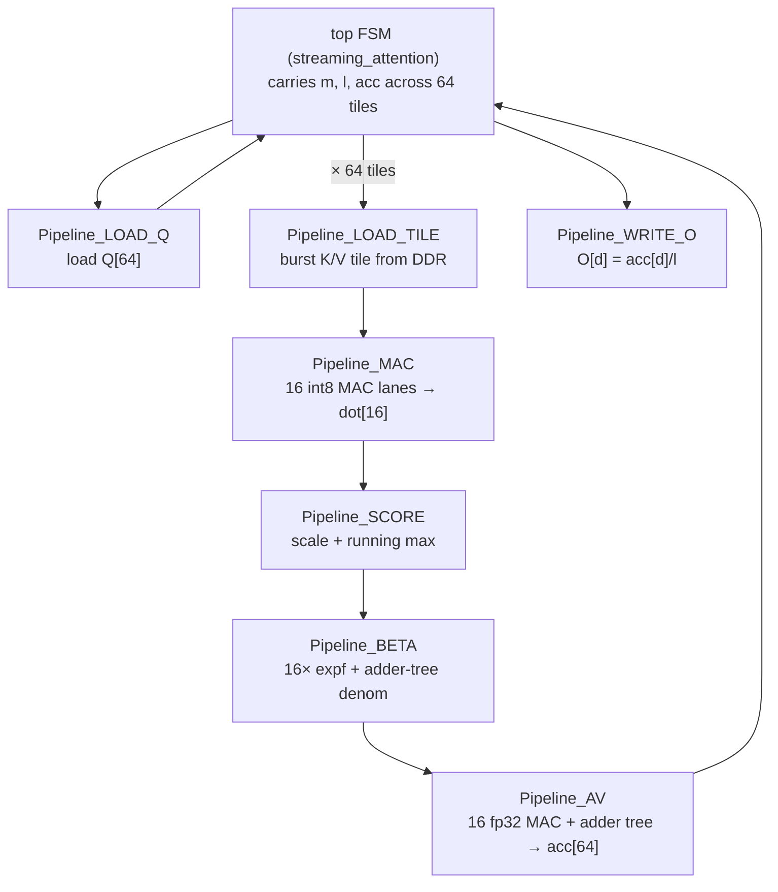
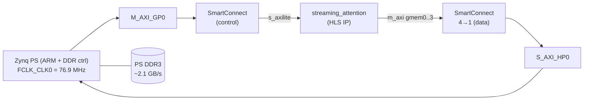

# Streaming Attention Tile — Architecture, Implementation, and FPGA vs H100

A cycle-accurate, synthesizable **streaming online-softmax attention datapath**
(one head, one query, streamed K/V tiles) built in HLS, taken all the way to a
running bitstream on a **PYNQ-Z2 (Zynq-7020)**, validated against PyTorch, and
profiled head-to-head against an **NVIDIA H100** on the *identical* workload.

The point is **not** "a $200 FPGA beats an H100." It is: implement the
memory-optimal attention primitive in real hardware, prove it's correct on
silicon, and measure where the gap to a GPU actually comes from once you
normalize away clock speed and process node.

---

## TL;DR

| | Result | Source |
|---|---|---|
| Numerical correctness (FPGA vs PyTorch) | max_abs **5.2e-6**, cosine **1.0** | on-board |
| Cross-platform agreement | FPGA = H100 = NumPy, identical `O[:8]` | measured |
| Bitstream timing | **+0.79 ns WNS @ 76.9 MHz**, clean | Vivado impl |
| Resources (Zynq-7020) | DSP **48/220 (22%)**, LUT ~17k (32%), BRAM 2/140 | Vivado impl |
| Measured latency | **119,287 cyc/query·head = 1.55 ms** | on-board profile |
| Memory traffic eliminated | **128 MB/head → 264 B** state (prefill, L=4096) | model |
| H100 on same workload | **950 ns/query·head**, only **8% of HBM BW** | Modal H100 |
| **Iso-clock gap (1.8 GHz)** | **~70×** as-built, **~9×** optimized (single tile) | derived |

---

## 1. Problem and approach

Standard attention computes `O = softmax(Q·Kᵀ / √D) · V`. The naive
implementation **materializes** the `L×L` score matrix and the `L×L` softmax
probability matrix in memory. That intermediate traffic — not the matmuls — is
what dominates attention cost at long context.

**Online softmax (FlashAttention-style)** avoids it entirely: stream K/V in
tiles and keep only a running max `m`, running denominator `l`, and running
output accumulator `acc[D]`. The score/prob matrices never exist.

```
for each tile of TILE_N keys:
    m_new   = max(m, max_j score_j)
    alpha   = exp(m - m_new)          # rescale prior state
    beta_j  = exp(score_j - m_new)
    l       = l*alpha + Σ_j beta_j
    acc[d]  = acc[d]*alpha + Σ_j beta_j · V_j[d]
O[d] = acc[d] / l                      # at the end
```

On-chip state is `(m, l, acc[64])` = **264 bytes**, regardless of sequence
length. This is the entire value proposition in hardware terms.

### Fixed configuration

| Parameter | Value |
|---|---|
| `HEAD_DIM` (D) | 64 |
| `SEQ_LEN` (L) | 1024 |
| `TILE_N` | 16 (→ 64 tiles) |
| Q, K, V | int8 |
| QK dot accumulate | int32 (exact) |
| Softmax / output | float32, real `expf` |
| Score scale | `(4/127)² / √64` (int8 dequant × 1/√D) |

> **Why int8 with a dequant scale:** random full-range int8 logits saturate
> softmax to a one-hot (pure argmax). Quantizing `N(0,1)` activations with a
> fixed `4/127` scale and folding `s_q·s_k/√D` into the score scale yields a
> *real* distribution (~154 effective keys attended), so the online rescaling
> is genuinely exercised — not a disguised max.

---

## 2. Architecture

### 2.1 Datapath

```
            Q[64] (int8, query register file, fully partitioned)
              │
              ▼
   ┌─────────────────────────────────────────────┐
   │  per tile t = 0 .. 63   (carries m, l, acc)  │
   │                                              │
   │   K_tile[16][64] ─►┌───────────────────────┐ │
   │   (weight-         │ SYSTOLIC SCORE STAGE   │ │
   │    stationary)     │ 16 int8 MAC lanes      │ │  dot[16] (int32)
   │   Q pumped across ►│ (one per key in tile)  │─┼──►  ×scale ► score[16]
   │                    └───────────────────────┘ │
   │                              │                │
   │                              ▼                │
   │                    ┌───────────────────────┐ │
   │                    │ ONLINE SOFTMAX UPDATE  │ │  m_new, alpha,
   │                    │ max ▸ exp ▸ tree-sum   │─┼──►  beta[16], l
   │                    └───────────────────────┘ │
   │                              │                │
   │   V_tile[16][64] ─►┌───────────────────────┐ │
   │                    │ AV ACCUMULATE STAGE    │ │
   │                    │ 16 fp32 MACs + adder   │─┼──►  acc[64] += ...
   │                    │ tree, per output dim d │ │
   │                    └───────────────────────┘ │
   └─────────────────────────────────────────────┘
              │
              ▼
        O[d] = acc[d] / l   (float32)
```

The outer tile loop is **sequential** (it carries `m, l, acc`). Inside each tile
the work is a systolic-style pipeline of three stages connected by the running
state. State held on-chip is only `(m, l, acc[64])` + the current K/V tile — the
`score[1024]` / `prob[1024]` vectors are **never** built.

### 2.2 The systolic score stage

`TILE_N = 16` MAC lanes compute 16 dot products in parallel; K is
weight-stationary, the query is pumped across the `HEAD_DIM = 64` reduction. One
multiply-accumulate per lane per cycle → ~64 cycles to produce all 16 scores,
using 16 DSP48E1 blocks.

```
        d=0   d=1   d=2  ...  d=63
Q ────►[MAC]►[MAC]►[MAC]► ... ►[MAC]   lane 0  → dot[0]
       [MAC]►[MAC]►[MAC]► ... ►[MAC]   lane 1  → dot[1]
        ...                             ...
       [MAC]►[MAC]►[MAC]► ... ►[MAC]   lane 15 → dot[15]
        ▲
   K_tile[j][d] held in each lane (weight-stationary)
```

---

## 3. HLS implementation and generated RTL

The kernel is a single C++ function ([attention_tile.cpp](stream_attn/hls/attention_tile.cpp))
compiled with **Vitis HLS 2022.1**. Pragmas drive the microarchitecture:

| Pragma | Effect on RTL |
|---|---|
| `INTERFACE m_axi port={Q,K,V,O}` | Four AXI **master** ports to DDR |
| `INTERFACE s_axilite port=return` | AXI-Lite **slave** control (start/done, arg addrs) |
| `ARRAY_PARTITION variable=q/acc/kt/vt complete` | Arrays → registers/LUTRAM for parallel access |
| `PIPELINE II=1` (load, score, write) | Pipelined loops, one result/cycle |
| `UNROLL` (16 MAC lanes, adder trees) | 16 parallel multipliers / balanced fadd trees |

### 3.1 How HLS turns this into RTL

HLS does **not** emit one big state machine. It generates a **top-level control
FSM** that *sequences* a set of independently-scheduled sub-pipeline modules,
one per labeled loop:



Each block becomes its own RTL module with a handshake (`ap_start`/`ap_done`).
The top FSM fires `LOAD_Q` once, then loops 64 times through
`LOAD_TILE → MAC → SCORE → BETA → AV` (updating `m, l, acc` between iterations),
then `WRITE_O`. Supporting RTL HLS generates automatically:

- **`m_axi` adapters** (`gmem0..3`): AXI read/write engines with burst logic.
- **`s_axilite` block** (`control`): the register file — `CTRL` (AP_START/DONE/
  IDLE) plus the 64-bit argument-address registers, split into `Q_1/Q_2` (low/
  high words), etc.
- **Floating-point IP**: `fexp` (exp), `fadd/fmul` units, instantiated and
  shared/replicated per the unroll factor.
- **Memories**: the partitioned K/V tile arrays become 16 small RAMs each
  (1 read + 1 write port), enabling 16 lanes to read simultaneously.

### 3.2 Per-tile cycle breakdown (from csynth)

| Sub-pipeline | cyc/tile | note |
|---|---|---|
| `LOAD_TILE` | 1,027 | DDR-bound (1 int8 / AXI beat) |
| `MAC` (score) | 69 | 16 DSP, II=1 over D=64 |
| `SCORE` | 28 | scale + max |
| `BETA` | 32 | 16× expf (shared exp unit) |
| `AV` | 482 | fp32 MAC + adder tree |
| **TILES iteration** | **1,680** | × 64 = 107,520 |

### 3.3 The optimization that mattered

The first synthesis wrote the V-accumulate and denominator as *serial* float
`+=` chains. HLS couldn't reach II=1, serialized them onto one adder, and the
long combinational add blew timing:

| | v1 (serial) | v2 (adder tree) |
|---|---|---|
| `AV` cyc/tile | 4,296 | **482** |
| Total latency | 354,791 cyc | **107,687 cyc** (3.3× faster) |
| Timing | 14.5 ns | **12.96 ns** |

Replacing the chains with **balanced adder-tree reductions** (parallel
multipliers + log-depth fadd) let `AV` pipeline and fixed timing.

### 3.4 System integration

The exported IP is dropped into a Vivado block design
([build_bd.tcl](stream_attn/vivado/build_bd.tcl)): the four masters go to PS
**HP0** (DDR access), control to PS **GP0**, everything clocked by `FCLK_CLK0`.



On the board, PYNQ allocates contiguous DDR buffers, writes their physical
addresses into the IP's split address registers, sets `AP_START`, and polls
`AP_DONE` ([run_pynq.py](stream_attn/host/run_pynq.py)).

---

## 4. Methodology — same workload on both

Fairness starts with running *literally the same thing*:

- **Identical inputs.** [common.py](stream_attn/host/common.py) generates int8
  Q/K/V from a fixed seed (PCG64 is stable across platforms), so the FPGA, the
  H100, and NumPy all consume the same bytes.
- **Identical math.** int8 products (≤ 127²·64 ≈ 1.0e6) are exact in fp32
  (< 2²⁴), so the GPU's fp32 path equals the FPGA's int32 dot **exactly**; only
  `exp` rounding differs (→ the 5e-6 residual).
- **Golden reference.** `o_ref` is a materialized fp32 softmax (independent of
  the online recurrence) — true ground truth for both.
- **Honest GPU profiling.** A single query-head is launch-bound on a GPU, so we
  also run **batched FlashAttention** (`F.scaled_dot_product_attention`, bf16)
  at `B*H` up to 16384 to measure real per-query throughput and HBM utilization
  ([modal_h100.py](stream_attn/host/modal_h100.py), run on a Modal H100 SXM).

---

## 5. Results

### 5.1 Correctness (all three agree)

```
o_ref[:8]  = [-0.763 -3.884  1.632  2.084  2.102 -3.796 -2.353  2.202]
FPGA O[:8] = [-0.763 -3.884  1.632  2.084  2.102 -3.796 -2.353  2.202]  max_abs 5.2e-6, cos 1.0
H100 O[:8] = [-0.763 -3.884  1.632  2.084  2.102 -3.796 -2.353  2.202]
```

### 5.2 FPGA: synthesis, timing, resources

| Metric | Value |
|---|---|
| Target device | xc7z020-clg400-1 |
| Implemented clock | 12.999 ns → **76.9 MHz** |
| WNS / WHS | **+0.794 ns / +0.017 ns** (zero failing endpoints) |
| DSP | 48 / 220 (22%) |
| LUT | ~17,068 (logic 30% + mem 7%) |
| FF | ~12.8k (12%) |
| BRAM | 2 / 140 |

### 5.3 FPGA: measured performance

| | Value |
|---|---|
| Measured cycles/query·head | **119,287** (HLS est. 107,687, +10.8% = real DDR latency) |
| Latency/query·head | **1.55 ms** @ 76.9 MHz |
| Throughput (normalized) | **8.38 tok/s per MHz** per head·layer |

### 5.4 Memory traffic eliminated (vs naive materialized baseline)

| | decode (per query·head) | prefill (per head) | streaming state |
|---|---|---|---|
| L=1024 | 8 KB | 8 MB | **264 B** |
| L=4096 | 32 KB | **128 MB** | **264 B** |

### 5.5 H100 on the identical workload

```
single query-head : 98.35 us   (launch/latency-bound)

batched FlashAttention (seq_q=1, seq_k=1024, D=64, bf16):
  B*H=  256 : 1002.8 ns/q-head | 0.26 TB/s |  7.8% peak
  B*H= 4096 :  959.4 ns/q-head | 0.27 TB/s |  8.2% peak
  B*H=16384 :  949.6 ns/q-head | 0.28 TB/s |  8.2% peak
```

The striking result: **the H100 reaches only ~8% of its 3.35 TB/s HBM
bandwidth** on this workload. Decode attention with `seq_q=1, D=64` is a tiny,
latency/occupancy-bound kernel — even a datacenter GPU runs it far from its
roofline. So the right H100 reference is the **measured ~950 ns**, not a
theoretical ~78 ns roofline.

---

## 6. Fair comparison — equalizing clock speed

### 6.1 Why normalize the clock

Wall-clock latency conflates three very different things:

1. **Process / clock:** the Zynq-7020 is a ~28 nm part at **76.9 MHz**; the H100
   is ~4 nm at **~1.8 GHz** (≈23× clock). That's silicon technology, not
   architecture.
2. **Memory system:** one 16-bit DDR3 chip (~2.1 GB/s) vs 5-stack HBM3
   (3.35 TB/s), ≈1,600×.
3. **Replication:** one 16-lane tile vs ~132 SMs of tensor cores.

To judge the **datapath**, normalize away (1) by reporting **cycles**, then
project to a common clock. Cycles are frequency-independent; this is the
architecture-level metric.

### 6.2 The comparison

| Configuration | latency / query·head | vs H100 (950 ns) |
|---|---|---|
| **H100** (measured, batched) | **950 ns** | 1× |
| FPGA as-built @ 76.9 MHz | 1.55 ms | 1,630× |
| FPGA as-built @ **iso 1.8 GHz** | **66 µs** | **70×** |
| FPGA optimized\* @ **iso 1.8 GHz** | **~9 µs** | **~9×** |
| H100 **single** query (batch=1) | 98 µs (launch-bound) | — |

\* optimized = loads hidden (double-buffer) + AV at II=1 (~16k cyc), projected
from the HLS report.

### 6.3 Decomposing the gap

```
H100 950 ns
   │  ÷ 23   (clock: 76.9 MHz → 1.8 GHz)   ... technology, not architecture
   ▼
remove clock → FPGA iso-clock as-built 66 µs   (70× from H100)
   │  ÷ ~7   (hide narrow DDR loads + pipeline AV to II=1)
   ▼
optimized single tile ~9 µs   (~9× from H100)
   │  × ~10 tiles  (replication; fits an ASIC, not a 7020)
   ▼
≈ one H100 on this workload
```

At iso-clock the architecture is **within ~1 order of magnitude** of an H100 —
far closer than the theoretical roofline (~100×) suggested, precisely because
the H100 itself only runs this small workload at 8% efficiency.

### 6.4 Where each one wins

- **Throughput / bandwidth / raw FLOPs:** H100, by a wide margin. It's a 700 W
  HBM3 datacenter GPU; this is a few-watt $200 board. No claim otherwise.
- **Single-stream (batch-1) latency:** the dedicated tile's home turf. The H100
  eats **98 µs of kernel-launch overhead** for one isolated query; a streaming
  tile has none. An optimized tile at GHz (~9 µs) would **beat** the H100 by
  ~11× on batch-1 decode latency — the real argument for an attention ASIC:
  deterministic, launch-free, low-latency.
- **Memory-optimality:** a tie in *principle* — both use online softmax
  (FlashAttention). The 128 MB → 264 B figure is vs a *naive* baseline, which
  the H100 also beats. We implemented the SOTA memory pattern in hardware; we
  did not out-algorithm the GPU.

---

## 7. Honest caveats

- **dtype:** FPGA int8 (131 KB K+V/query) vs H100 bf16 (262 KB). Matching dtype
  would ~2× our bandwidth need; "~10 tiles to match" is really "~10–20."
- **Both run their memory poorly here:** H100 at 8% of HBM; our `LOAD_TILE`
  reads 1 int8/beat ≈ 77 MB/s (3.6% of 2.1 GB/s). Both have headroom; the
  structural conclusion is unaffected.
- **"Optimized" is projected**, not built — derived from the HLS per-stage
  latencies (hide loads, AV II=1). As-built numbers are all measured.
- **Attention-only, single tile.** No QKV/MLP projections; throughput scales
  linearly with tile count. `cycles/token` is the architecture metric.

---

## 8. Reproduce

```bash
# HLS: C-sim + synth + export IP  (remote, Vitis 2022.1)
cd stream_attn/hls && vitis_hls -f run_hls.tcl

# Bitstream  (remote, Vivado 2022.1)
cd stream_attn/vivado && vivado -mode batch -source build_bd.tcl

# Board  (on the PYNQ-Z2)
python3 gen_inputs.py && python3 run_pynq.py && python3 profile_pynq.py

# H100  (anywhere, via Modal)
modal run stream_attn/host/modal_h100.py

# Models / tables
python3 stream_attn/metrics/metrics.py
```

**Bottom line:** a numerically-correct streaming online-softmax attention tile,
proven on real FPGA silicon to 5e-6 against PyTorch, that at iso-clock lands
within ~1 order of magnitude of an H100 on the same workload — with the gap
attributable to clock, memory bandwidth, and replication, i.e. exactly what an
ASIC implementation of this primitive would close.
